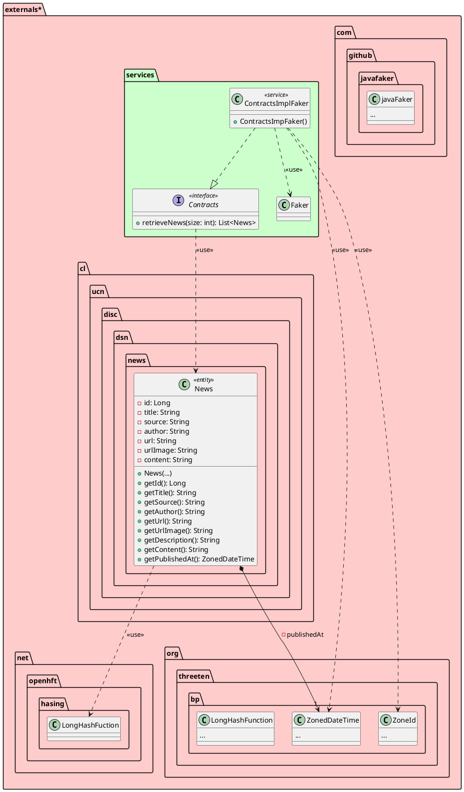

# 
#The News Project

Android Project to show a list of News.
## Class Model

```puml
@startuml
package externals* #ffcccc{
package org.threeten.bp {
    class ZonedDateTime {
            ...
        }
        
        class ZoneId{
            ...
        }
        class LongHashFunction {
            ...
            
        }
     }
     package com.github.javafaker {
     class javaFaker{
     ...
     }
   
   }
   
    
    

package net.openhft.hasing {
class LongHashFuction {
}
}

package cl.ucn.disc.dsn.news {

        class News <<entity>> {
        - id: Long
        - title: String
        - source: String
        - author: String
        - url: String
        - urlImage: String
        - content: String
        +News(...)
        +getId(): Long
        +getTitle(): String
        +getSource(): String
        +getAuthor(): String
        +getUrl(): String
        +getUrlImage(): String
        +getDescription(): String
        +getContent(): String
        +getPublishedAt(): ZonedDateTime
        }
        News *--> "1" ZonedDateTime : -publishedAt
        News ..> LongHashFuction: <<use>>
    }
     package services #ccffcc {
    interface Contracts <<interface>> {
        + retrieveNews(size: int): List<News>
    }
    Contracts ..> News: <<use>>
    class ContractsImplFaker <<service>> {
    + ContractsImpFaker()
    
    }
    ContractsImplFaker ..|> Contracts
    ContractsImplFaker ..> ZonedDateTime : <<use>>
    ContractsImplFaker ..> ZoneId : <<use>>
    ContractsImplFaker ..> Faker : <<use>>
    }
}
@enduml
```

## License
[MIT](https://chosealicense.com/licenses/mit/)
